# StreamShard

A distributed event ingestion and aggregation engine, consistent-hash sharding, quorum replication, SWIM membership, and a full scalability study on GCP. Built for the Scalability Engineering course (SS26, TU Berlin)

**Team:** Jakob (Jakob-al28) and Javier (Xaverherdel)

---

## Architecture

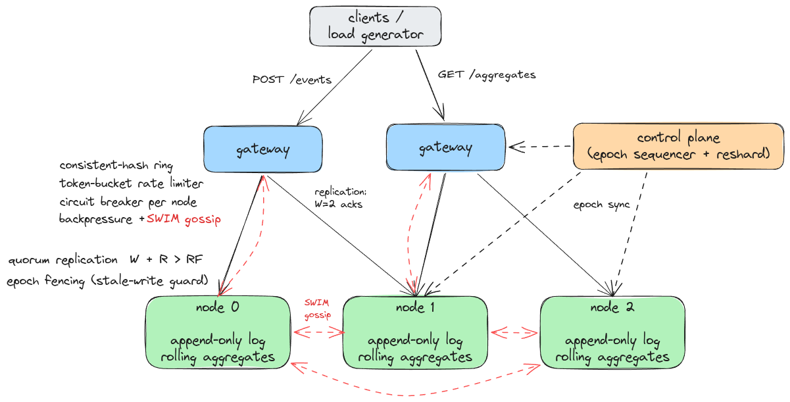

### Summary

Metric: committed write throughput under a 4 s SLA. Durable writes benchmarked, with bottlenecks identified via per-tier CPU profiling. Full details in [Scaling behaviour](#scaling-behaviour) and [Findings](#findings-and-next-steps).

- **Bottleneck shifts by config.** RF=1 is gateway-bound and
  scales near-linearly (9.3k -> 29k -> 44k committed/s, 1/3/5 nodes, e2-standard-2). RF=3
  is bound by wherever the replication fan-out runs.
- **Gateway fan-out is ~2x faster** (5-node: 18.9k vs 8.6k). Primary-replication concentrates each key's fan-out on
  one primary, which CPU-saturates (93% / 3% idle); gateway fan-out spreads it.
- **Core count helps parallel work, core speed helps serial work.** Doubling vCPU at the
  same clock (e2-standard-2 -> e2-standard-4) nearly doubled 5-node primary-replication
  (8.6k -> 17.2k) but barely moved the serial 1-node case
  (9.3k -> 9.6k). A higher-clock machine with the same 4 cores (c2-standard-4, 3.8 GHz)
  did the opposite: +20% on 1-node (9.6k -> 11.2k). CPU sampling backs both: the primary
  saturates under replication, the 1-node gateway path is serial.
- **Write batching regressed throughput** (9.6k -> 6.7k as batch grows): the ack path is serial, so the fix is several apply goroutines or a faster core.

### Contents

- [Summary](#summary)
- [Architecture](#architecture)
- [Requirements](#requirements)
- [Build & test](#build--test)
- [Running locally](#running-locally)
- [Deploying on GCP](#deploying-on-gcp)
- [Benchmarking](#benchmarking)
- [Scaling behaviour](#scaling-behaviour)
- [Findings and next steps](#findings-and-next-steps)
- [Resharding](#resharding)
- [API reference](#api-reference)
- [Limitations](#limitations)

### Stateless / stateful split

**Gateways** hold no partition state. They can be added, killed, or restarted without data loss. Routing is deterministic for a given node set. With SWIM enabled the node set is dynamic: joins and deaths add or remove nodes from the ring.

**Partition nodes** own an append-only log and aggregates for their key-space. Log entries are never overwritten. Node state persists across restarts via the on-disk WAL, snapshot, and epoch file.

## Requirements

| Requirement | Approach | Implementation |
|-----|----------|---------------|
| 1 | Stateless gateways + stateful nodes | `cmd/gateway`, `cmd/node` |
| 2 | Consistent-hash partitioning, quorum replication, 1/3/5 configs | `internal/ring`, `internal/partition`, Terraform |
| 3 | Queue-depth watermark, 429 before channel fills | `cmd/node` `checkShedding()` |
| 4a | Custom token bucket (atomic refill) | `internal/ratelimit` |
| 4b | Custom circuit breaker (closed/open/half-open) | `internal/breaker` |
| Bonus | SWIM gossip failure detection, dynamic ring updates, primary failover; alternative primary-driven replication path; larger-instance benchmark (e2-standard-4, vertical scaling) | `internal/membership`, `cmd/node`, `deploy/terraform`, `bench/` |

---

## Build & test

```bash
go build ./...
go test ./...
go test -race ./...
go vet ./...
```

---

## Running locally

```bash
# Single node (RF=1)
go run ./cmd/node --addr :8080 --data-dir /tmp/node0

# Gateway pointing at it
go run ./cmd/gateway --addr :7070 --peers localhost:8080 --rf 1 --w 1

# Post an event
curl -X POST http://localhost:7070/events \
  -H 'Content-Type: application/json' \
  -d '{"id":"e1","key":"login","value":{}}'

# Query aggregates
curl http://localhost:7070/aggregates
```

Three-node cluster with SWIM:

```bash
go run ./cmd/controlplane --addr :6060

go run ./cmd/node --addr :8081 --data-dir /tmp/n0 \
  --swim-addr 127.0.0.1:9081 --swim-http-addr localhost:8081

go run ./cmd/node --addr :8082 --data-dir /tmp/n1 \
  --swim-addr 127.0.0.1:9082 --swim-http-addr localhost:8082 \
  --swim-seeds 127.0.0.1:9081

go run ./cmd/node --addr :8083 --data-dir /tmp/n2 \
  --swim-addr 127.0.0.1:9083 --swim-http-addr localhost:8083 \
  --swim-seeds 127.0.0.1:9081

go run ./cmd/gateway --addr :7070 \
  --peers localhost:8081,localhost:8082,localhost:8083 \
  --controlplane localhost:6060 \
  --rf 3 --w 2 \
  --swim-addr 127.0.0.1:9070 \
  --swim-seeds 127.0.0.1:9081,127.0.0.1:9082,127.0.0.1:9083
```

---

## Deploying on GCP

### Prerequisites

- [Terraform](https://www.terraform.io/) >= 1.5
- `gcloud` CLI authenticated (`gcloud auth application-default login`)
- GCP project `se-streamshard` with Compute Engine API enabled

Gateways scale 1:1 with nodes (`gateway_count` should match `node_count`) so a single
gateway never becomes the bottleneck. Replication routes over the static `--peers` ring,
and nodes default to `--no-idempotent` so committed writes are real durable appends. The
three required configs:

```bash
cd deploy/terraform
terraform init

# 1-node
terraform apply -var="node_count=1" -var="gateway_count=1" -var="rf=1"

# 3-node
terraform apply -var="node_count=3" -var="gateway_count=3"

# 5-node
terraform apply -var="node_count=5" -var="gateway_count=5"
```

This brings up the SUT (nodes, gateways, control plane, and an external load balancer).
The load-generation **GKE cluster is separate** and created once, see
[Benchmarking](#benchmarking) for the `gcloud container clusters create` command.

(SWIM gossip membership is implemented but default is off: `enable_swim=true` to turn it
on.)

### Bonus: larger instance type (vertical scaling)

```bash
terraform apply -var="node_count=3" -var="gateway_count=3" \
  -var="machine_type=e2-standard-4" -var="gateway_machine_type=e2-standard-4"
```

### Primary-driven replication (RF=3, alternative replication path)

By default the gateway fans out replica writes. With `--primary-replication` the
primary node fans out instead. Enable via:

```bash
terraform apply -var="node_count=3" -var="gateway_count=3" -var="rf=3" \
  -var="primary_replication=true"
```

Under measurement this path is actually **~2x slower** than gateway fan-out,
because each key's fan-out is concentrated on that key's single primary node, which
saturates its CPU (gateway fan-out spreads the same work across all gateways). It does,
however, scale ~linearly with vCPU, so it is the path
used for the vertical-scaling comparison. See *Scaling behaviour*.

### Benchmark flags

`disable_ratelimit=true` (default) skips per-key rate limiting for clean throughput
measurement. Set to `false` for the rate-limiting demo.

Terraform outputs the gateway external IP. VMs build the binary from source on first boot. Check service status:

```bash
gcloud compute ssh streamshard-node-0 --zone=europe-west3-a --command "sudo systemctl status streamshard-node"
```

If a zone is capacity-constrained (`does not have enough resources`), override the
zone: `-var="zone=europe-west3-b"`. The GKE load-generation cluster is unaffected,
it reaches the gateway over the external load-balancer IP regardless of VM zone.

### Teardown

```bash
terraform destroy -auto-approve
```

`terraform destroy` deletes resources in dependency order automatically, so this is
normally all you need. If a previous destroy was interrupted (leaving the state
inconsistent), GCP can refuse to delete the target pool while the forwarding rule still
references it. In that case remove the rule first, then destroy the rest:

```bash
terraform destroy -auto-approve -target=google_compute_forwarding_rule.gateway_lb
terraform destroy -auto-approve
```

---

## Benchmarking

### Distributed load via GKE

One k6 process maxes out its own NIC before it can saturate StreamShard, so we spread the load. `run_benchmark.sh --k8s` runs N k6 pods on a GKE cluster, each doing a slice of the sweep, and `bench/k8s/aggregate.py` merges their results per offered-load step into the JSON `usl.py` reads.

Create the GKE load-generation cluster once. Use `pd-standard` disks:

```bash
gcloud container clusters create streamshard-bench \
  --project se-streamshard --zone europe-west3-a \
  --num-nodes 12 --machine-type e2-standard-2 \
  --disk-type pd-standard --disk-size 50 \
  --no-enable-autoupgrade --quiet
```

`--rps` is the **peak offered load at the top of the ramp** (total system, not per-node). The sweep staircases 0 until `--rps` over 40 steps and records achieved throughput per step. The operator splits `--rps` across `--workers` pods via execution segments.

#### Settings the result set was produced with

| Setting | Value | Why |
|---|---|---|
| `enable_swim` (terraform) | `false` | Replication uses the static `--peers` ring, so SWIM is not needed. |
| `--no-idempotent` (node) | on | Disables dedup so every write is a durable append. |
| `--workers` | `12` | 4 workers under-drove the high-ceiling configs (RF=1, gateway fan-out) and reported peaks below saturation. 12 pushes them over. |
| `--rps` (cap) | per config | Each config saturates at a different load, so an appropriate cap was chosen per config. |
| `--label-suffix` | none / `_pr` | No suffix = gateway fan-out (the default path); `_pr` = primary-replication runs (`primary_replication=true`). |
| `disable_ratelimit` (terraform) | `true` | Clean throughput, no per-key limiting. |

Example: the RF=1 sweep (gateway fan-out, 12 workers, per-config caps):

```bash
# Prerequisites: gcloud authed, kubectl installed, terraform applied, GKE cluster up
GW_IP=$(cd deploy/terraform && terraform output -raw lb_ip)

./bench/run_benchmark.sh "http://$GW_IP:7070" 1 --rps 80000 --k8s --workers 12 --rf rf1
./bench/run_benchmark.sh "http://$GW_IP:7070" 3 --rps 80000 --k8s --workers 12 --rf rf1
./bench/run_benchmark.sh "http://$GW_IP:7070" 5 --rps 80000 --k8s --workers 12 --rf rf1
```

Gateway fan-out is the default and gets no suffix. For primary-replication runs, deploy
with `-var="primary_replication=true"` and add `--label-suffix _pr`.

Results land in `bench/results/` as `{N}node_{instance}_{rf}{suffix}.json`. Once all three
node counts for a label are collected, fit/plot the curve (`--xmax` clips the load-generation tail for readability; it does not affect the peaks):

```bash
python3 bench/analysis/usl.py \
  bench/results/1node_e2_rf3.json \
  bench/results/3node_e2_rf3.json \
  bench/results/5node_e2_rf3.json \
  --nodes 1 3 5 \
  --title "RF=3 gateway-fanout, e2-standard-2" \
  --xmax 30000 \
  --out bench/results/scaling_rf3_gwfanout.png
```

### Reproducing the result set

`bench/run_matrix.sh` runs the whole sweep: for each cell it deploys the SUT
with Terraform, waits for health,
runs the load sweep through the GKE cluster, then tears the SUT down and moves to the next cell. 
The `MATRIX` covers RF=1 and RF=3 (gateway fan-out) on e2-standard-2, the RF=3 primary-replication 
path, and RF=3 on e2-standard-4 for both gateway-fanout and primary-replication. Each cell carries
its own worker count, per-config `--rps` cap, and suffix (none for gateway fan-out, `_pr`
for primary-replication). It skips any cell whose result JSON already exists.

The GKE load-generation cluster (above) must already exist; the matrix drives load
through it but does not create it.

```bash
./bench/run_matrix.sh
```

Results for each cell land in `bench/results/{N}node_{instance}_{rf}{suffix}.json`.

To run a single config by hand instead (cluster must already be deployed):

```bash
GW_IP=$(cd deploy/terraform && terraform output -raw lb_ip)
./bench/run_benchmark.sh "http://$GW_IP:7070" 5 --k8s --workers 12 --rps 40000 --rf rf3
```

### Local quick check

For a fast sanity run against a local or single deployed gateway, k6 can run the
sweep directly:

```bash
k6 run -e BASE_URL=http://localhost:7070 -e MAX_RPS=5000 bench/k6/write_sweep.js
```

### Where the bottleneck is

`bench/poll_cpu.sh` samples per-process CPU on every node and gateway during a run.
`run_benchmark.sh` starts it automatically and writes one CSV per result
(`{N}node_..._cpu.csv`), so each throughput curve has a matching CPU trace.
Under gateway fan-out, the gateway is the busy tier; under primary-replication the data node is
(~93% CPU / 3% idle at the peak). See *Scaling behaviour* below.

To run it standalone against an already-deployed cluster:

```bash
NODES=5 GATEWAYS=5 ./bench/poll_cpu.sh > /dev/null 2>&1 &   # start before a sweep
#  run a sweep
pkill -f poll_cpu.sh                       # stop when done
```

---

## Scaling behaviour

Committed write throughput under the 4 s SLA (see [Summary](#summary) for the metric and
methodology). Peak committed writes/s, e2-standard-2:

| Config | 1 node | 3 node | 5 node |
|--------|-------:|-------:|-------:|
| RF=1                       | 9,310 | 29,241 | 44,197 |
| RF=3 (gateway fan-out)     | 9,310 | 11,493 | 18,916 |
| RF=3 (primary-replication) | 9,310 |  5,587 |  8,571 |

RF=3 configs with primary replication enabled on e2-standard-4:

| Config | 1 node | 3 node | 5 node |
|--------|-------:|-------:|-------:|
| RF=3 (primary-replication) | 9,620 | 10,230 | 17,153 |

(1 node forces RF=1, so the 1-node column is identical across
RF=3 modes. The e2-standard-2 primary-replication 3/5-node
runs used 4 k6 workers, not 12; that is fine because the data-node CPU was saturated at
the peak in both, ~3% idle, so 4 workers was enough to reach the real ceiling, see
below.)

**RF=1 scales near-linearly with real writes** (9.3k -> 29k -> 44k). No replication, so a
write is one local append; throughput grows with the number of independent
gateway+node pipelines.

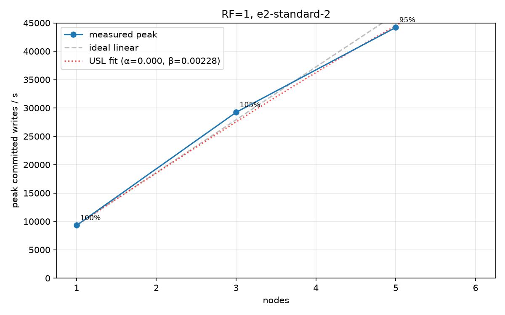
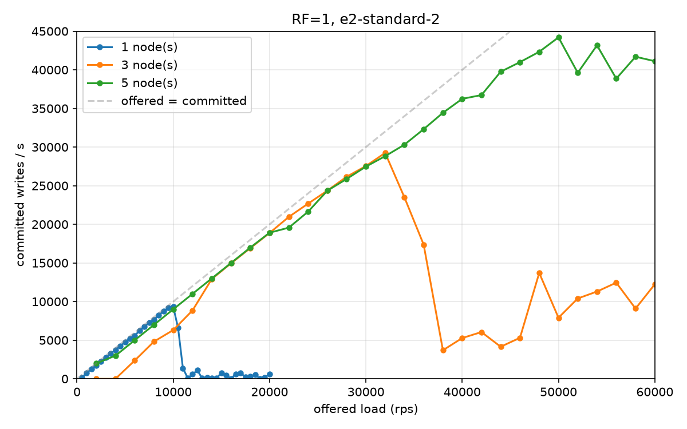

**Gateway fan-out beats primary-replication for throughput (~2×).** With gateway fan-out the replication work is
spread across all N gateways, so it scales (3-node 11.5k -> 5-node 18.9k). With
primary-replication the fan-out for a key is concentrated on that key's single primary
node, which saturates its CPU, so 3-node PR (5.6k) drops *below* the 1-node
baseline (9.3k), and 5-node only recovers to 8.6k. CPU sampling confirms it: at the
primary-replication peak the data node runs at ~93% CPU / 3% idle, while
under gateway fan-out the gateway is the busier tier.

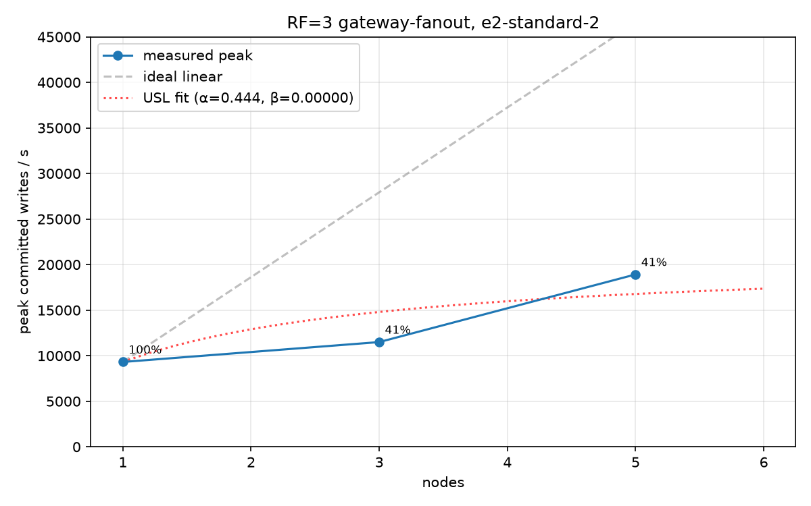
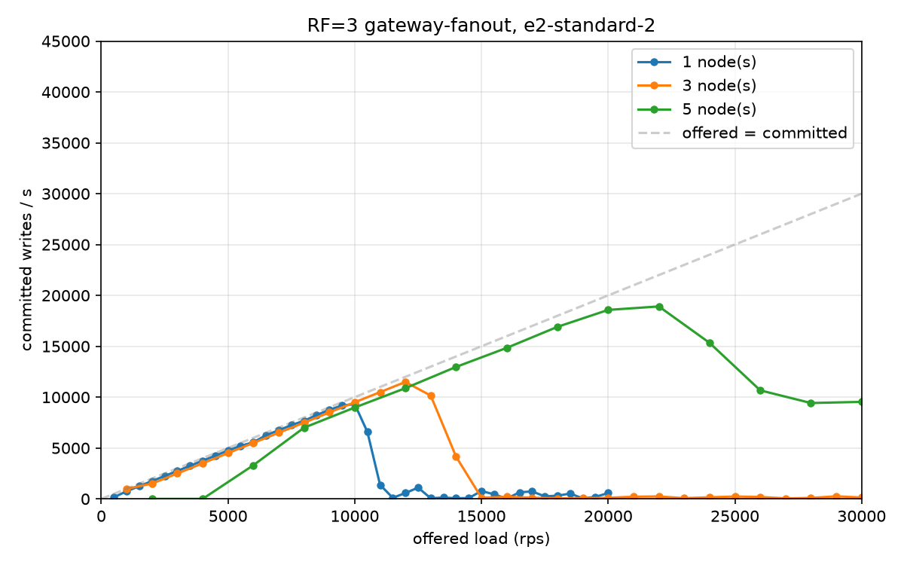

**Vertical scaling (e2-standard-4) doubles the primary-replication ceiling**, which
proves that path was CPU-bound on the primary. The two plots below are the same
primary-replication configuration on the two machine sizes:

| RF=3 primary-replication | 1 node | 3 node | 5 node |
|--------------------------|-------:|-------:|-------:|
| e2-standard-2 (2 vCPU)   | 9,310  |  5,587 |  8,571 |
| e2-standard-4 (4 vCPU)   | 9,620  | 10,230 | 17,153 |

Doubling the vCPU roughly doubled the replicated configs: 3-node went 5.6k -> 10.2k and
5-node went 8.6k -> 17.2k (both about 1.8-2.0x for 2x the cores). Throughput increasing with the core count shows that the limit was CPU, specifically the primary node doing
the replication fan-out. That fan-out is parallel work (a goroutine per replica), which is why vertical scaling helped here.

The 1-node number is the exception: it barely moves (9.3k -> 9.6k). With one node there
is no replication, so the node is not the busy part, the CPU samples show it mostly idle
while the gateway is maxed out. The 1-node work is serial, and adding more cores of the same speed cannot speed up serial work.

e2-standard-2 (baseline):

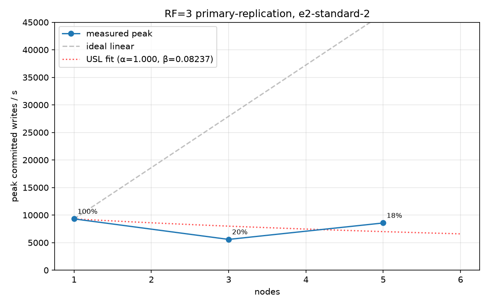
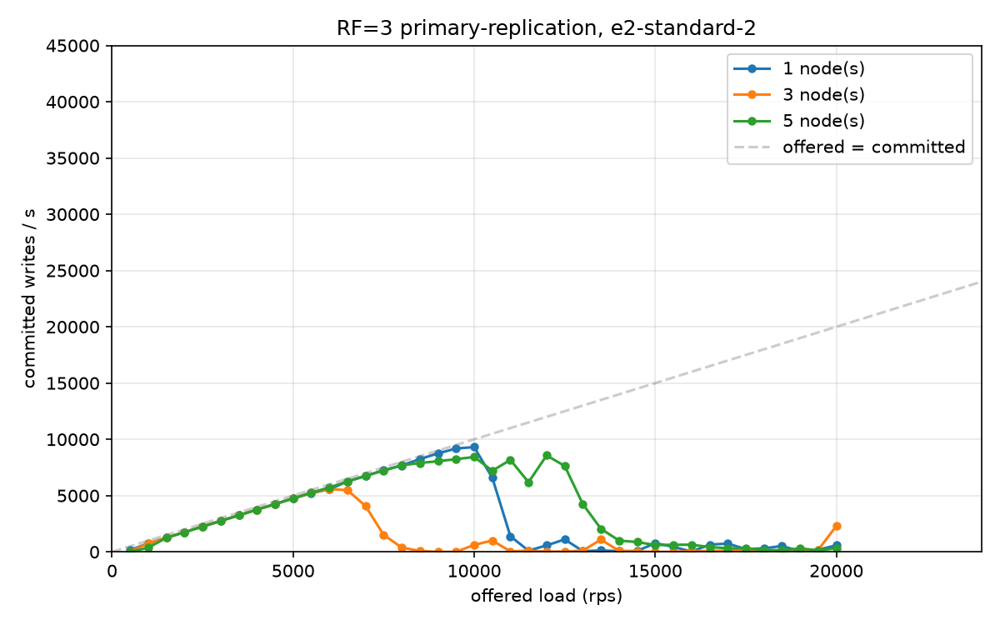

e2-standard-4 (2× vCPU):

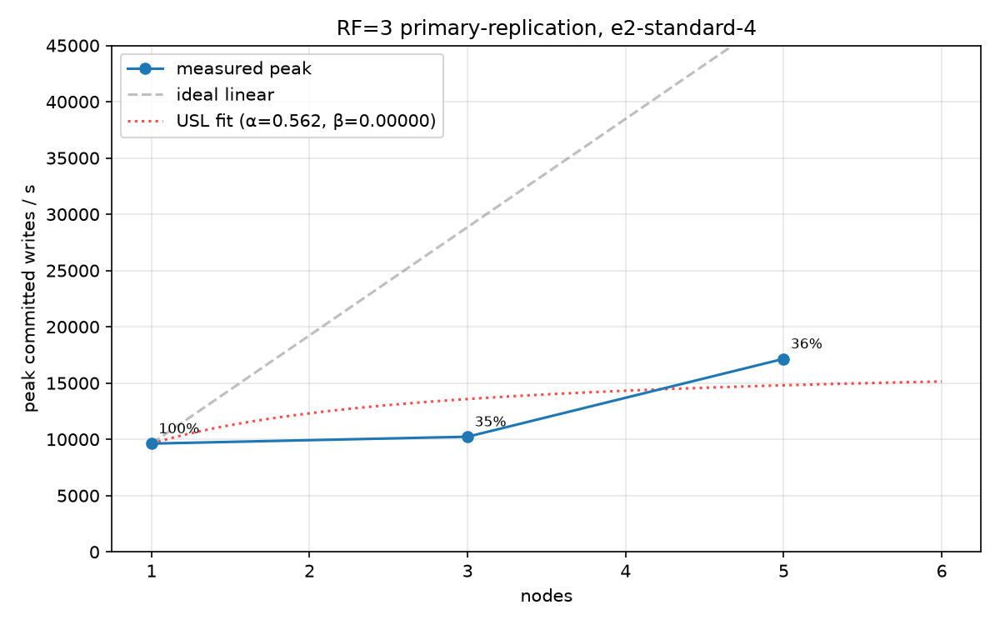
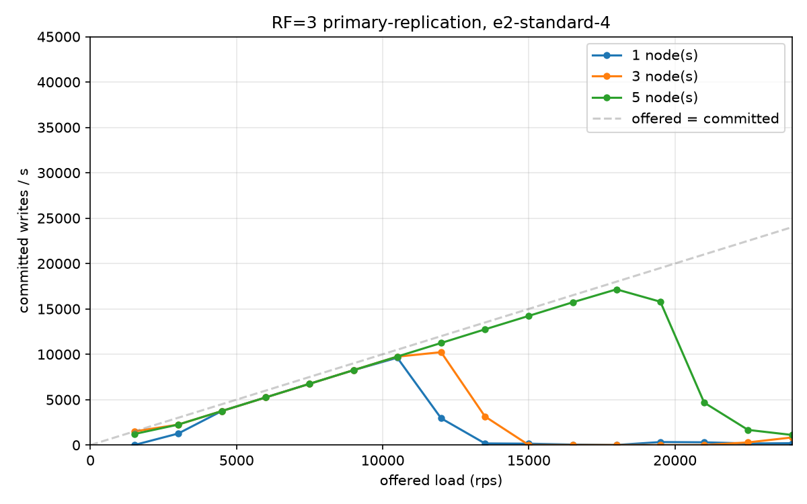

### More cores vs a faster core

To confirm the 1-node limit is serial (clock-bound, not core-count-bound), we ran the
same 1-node config on three machines: same number of cores but a faster clock is the
variable that matters.

| 1-node, RF=3 | cores / clock | peak committed/s |
|--------------|---------------|-----------------:|
| e2-standard-2 | 2 vCPU, ~2.5 GHz       | 9,310 |
| e2-standard-4 | 4 vCPU, ~2.5 GHz       | 9,620 |
| c2-standard-4 | 4 vCPU, **3.8 GHz**    | **11,180** |

Doubling the cores at the same clock did almost nothing, but the higher-clock c2
machine increased throughput by about 20% with the same 4 cores.

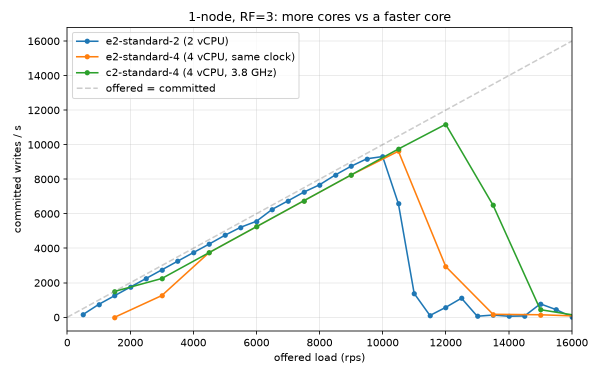

---

## Findings and next steps

The single-node ceiling (~9.3k) is serial work: each node applies writes through one
goroutine, and the gateway acks only after that goroutine replies. Serial work does not
benefit from more cores (e2 -> e2big flat) but does from a faster core (c2 +20%). The
replicated configs scale with cores because their extra work, the fan-out, is parallel.

**WAL batching: a measured negative result.** We added an opt-in `--wal-batch N` (drain
N queued writes, one `write()` syscall for the batch; tested for correctness in
`TestBatchedAndUnbatchedAgree` / `TestBatchedDurableWAL`). It made 1-node throughput
*worse*, monotonically with batch size:

| `--wal-batch` | peak committed/s |
|--------------:|-----------------:|
| 1 (off)       | 9,620 |
| 8             | 8,206 |
| 64            | 6,734 |

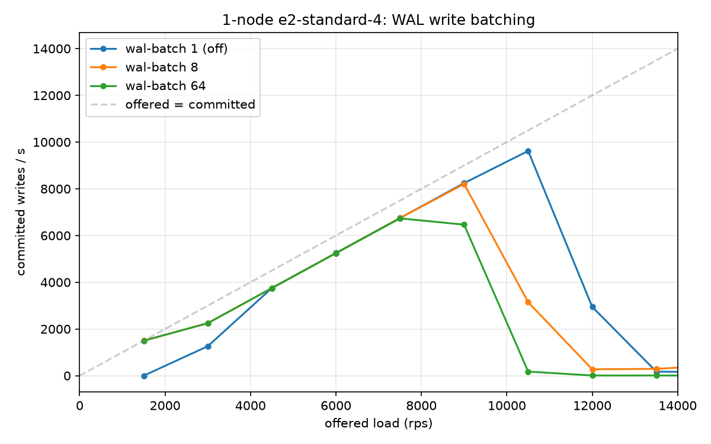

Acks are synchronous per request, but a batch can't reply to anyone until it fully
flushes. The apply goroutine holds the lock through the whole batch, so all N requests
wait on the slowest one and latency climbs. CPU traces confirm it is not resource
exhaustion: the node is ~45% idle at collapse, stalled on the lock. The limit is the
serial apply goroutine, so the ways up are sharding the partition into several apply
goroutines (intra-node parallelism) or a faster core (the c2 result above), not batching.

---

## Resharding

```bash
# Live reshard (default): source never freezes, target buffers writes during transfer, favours availability
curl -X POST http://CP_IP:6060/reshard \
  -H 'Content-Type: application/json' \
  -d '{"source":"NODE0_IP:8080","target":"NODE2_IP:8080","partition":"_default"}'

# Synchronous reshard: brief 503 window, no buffering on target
curl -X POST http://CP_IP:6060/reshard \
  -H 'Content-Type: application/json' \
  -d '{"source":"NODE0_IP:8080","target":"NODE2_IP:8080","partition":"_default","live":false}'
```

**Live path (default):** target enters `Loading` state and buffers incoming writes while pulling the snapshot and WAL tail from the source. Once the transfer finishes the buffer replays into the partition. Source is never frozen, so write availability is uninterrupted.

**Synchronous reshard (`live: false`):** control plane freezes the source (writers see 503), bumps the epoch, triggers the transfer, then thaws.

---

## API reference

### Node (`cmd/node`)

| Method | Path | Description |
|--------|------|-------------|
| POST | `/events` | Ingest event `{id, key, value}`. 201 fresh, 200 dup, 202 buffered (reshard), 409 stale epoch, 429 overloaded, 503 frozen |
| POST | `/replicate` | Replica write (same body, no re-routing) |
| GET | `/aggregates` | Windowed counts + top-K for this node's partition |
| GET | `/log?from=N` | Log entries from offset N |
| GET | `/snapshot` | Current compaction snapshot |
| GET | `/health` | Queue depth, epoch, reshard state |
| POST | `/reshard/freeze` | Freeze partition for snapshot transfer |
| POST | `/reshard/thaw` | Resume writes after reshard |
| POST | `/reshard/load` | Pull log from source and replay |
| POST | `/reshard/abort` | Abort a stuck live reshard, clear Loading state |

### Gateway (`cmd/gateway`)

| Method | Path | Description |
|--------|------|-------------|
| POST | `/events` | Route to owner via ring. Default: gateway fans out to replicas, returns after W acks, remaining replicas propagate in the background (detached context) to reach RF. With `--primary-replication`: gateway sends only to the primary, which fans out itself |
| GET | `/aggregates` | Scatter-gather from all nodes, merge counts |
| GET | `/ring?key=K` | Show owner + replicas for key K |
| GET | `/health` | Per-node queue depth + circuit-breaker state |
| GET | `/swim` | Current SWIM member list |

### Control plane (`cmd/controlplane`)

| Method | Path | Description |
|--------|------|-------------|
| GET | `/epoch?partition=P` | Current epoch for partition |
| POST | `/epoch/bump?partition=P` | Increment and return epoch |
| GET | `/epochs` | All partition epochs |
| POST | `/reshard` | Orchestrate reshard (`live` bool, default true) |
| POST | `/failover` | Bump epoch for a dead node, fence it out |

---

## Limitations

**Consensus / epoch**
- No Raft or Paxos; the control plane is a single sequencer and a disclosed SPOF for epoch assignment. Production would use etcd or ZooKeeper
- Single control plane, so it is a SPOF for resharding and epoch assignment
- Only one epoch namespace (`_default`), so there is no true per-shard fencing if you add multiple logical partitions
- Gateway epoch is in-memory; if the gateway and CP restart at the same time there is a brief window where the epoch could be stale
- No two-phase quorum promotion; a replica is promoted by bumping the epoch via CP, not by a Paxos round

**Ring / routing**
- Overload detection lags by up to 1s because the gateway polls node health on an interval
- The SWIM member list is in-memory and repopulates from seeds within about 1s on restart
- Without incarnation numbers, a falsely suspected node gets removed from the ring and has to rejoin
- With multiple gateways, ring updates can lag by under a second via SWIM. During that window a write might go to the old or new node. Epoch fencing triggers a retry for the synchronous reshard path, but the live reshard path has no epoch bump so brief replica divergence is possible

**Replication**
- Replicas are propagated asynchronously and can lag behind the primary
- Reads always go to the primary, no read quorum is enforced
- Resharding is manual; node death does not automatically trigger a rebalance or replica promotion

**Log / storage**
- WAL is fsynced every 100ms, so up to 100ms of writes can be lost on a hard crash
- No ordering guarantee across replicas; concurrent writes may be applied in different orders
- Idempotency index is unbounded in memory and never cleared

**Aggregates**
- One partition per node with no further key-space splitting inside it
- Window eviction runs on writes and queries, not on a background timer
- Top-K uses exact counts, which does not scale to high cardinality (a Count-Min Sketch would)

**Load shedding**
- Shedding is per-node, not per-key, so a hot key can starve other keys on the same node
- The gateway learns about overload reactively via 429s or health polls, with no proactive signal from the node

**Token bucket**
- Buckets are per-key but per-gateway, so two gateways effectively double the allowed rate
- No coordination across gateways

**Security**
- All traffic is plaintext HTTP, no TLS
- No authentication; any client can write, read, or trigger a reshard

### Future work

- **Two-phase routing transition:** coordinate ring updates across gateways before committing, closing the multi-gateway consistency window during resharding
- **Read quorum:** enforce R quorum on reads so stale replicas cannot serve data; currently reads always go to the primary
- **Per-shard epoch fencing:** one epoch per logical partition instead of a single `_default` namespace
- **Incarnation numbers:** per-node counter in SWIM so a falsely-suspected node can refute dead events before they propagate
- **Per-key queue isolation:** intra-node fairness between keys; matters at high cardinality or skewed workloads
- **Count-Min Sketch for top-K:** bound memory at high cardinality
- **Global rate limiting:** coordinate token bucket state across gateways
