# StreamShard

A distributed event ingestion and aggregation engine: consistent-hash sharding, quorum-based write replication, SWIM membership, overload protection via token buckets, circuit breakers and load shedding, and a full scalability study on GCP. Built for the Scalability Engineering course (SS26, TU Berlin)

**Team:** Jakob (Jakob-al28) and Javier (Xaverherdel)

**Presentation:** <br>
[docs/Prototyping_distributed_systems_Jakob_Javier.pdf](docs/Prototyping_distributed_systems_Jakob_Javier.pdf) 
[docs/Prototyping_distributed_systems_Jakob_Javier.pptx](docs/Prototyping_distributed_systems_Jakob_Javier.pptx)

---

## Architecture

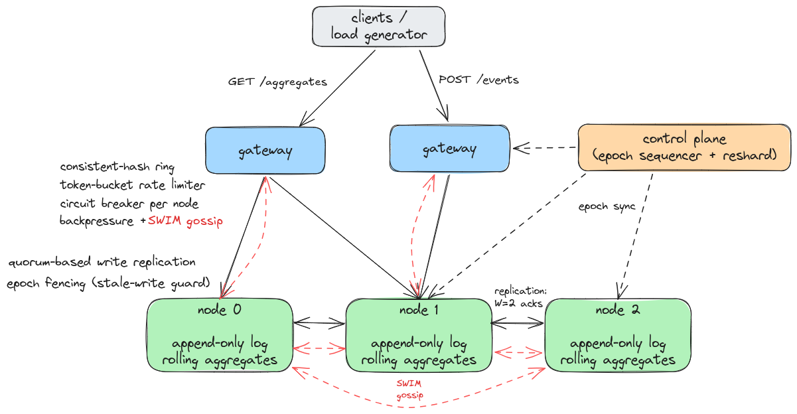

### Summary

Metric: committed write throughput under a 4 s SLA. A write still in flight after 4 s is
counted as failed by the load generator regardless of whether the server eventually
replies, which is why every curve rises to a peak and then collapses instead of
plateauing: past the ceiling, latency climbs into the seconds and more writes miss the
SLA. Durable writes benchmarked, with bottlenecks identified via per-tier CPU profiling.
Full details in [Scaling behaviour](#scaling-behaviour) and [Findings](#findings-and-next-steps).

- **Bottleneck shifts by config.** The node's serial WAL apply loop (~10k/node) is always
  the underlying bottleneck, and RF=1 scales near-linearly against that ceiling
  (9.3k -> 29k -> 44k committed/s, 1/3/5 nodes, e2-standard-2). Primary-replication adds
  replication fan-out onto that same node. CPU is not yet saturated at the point
  throughput peaks (busiest node ~46-57% of its ceiling); it keeps climbing well past
  that as offered load increases further, but throughput does not follow, which points
  to synchronous quorum-wait rather than raw CPU exhaustion as the limit at peak.
  Gateway fan-out moves the fan-out cost off the node, back to just the serial WAL
  bottleneck.
- **Gateway fan-out is ~2x faster than primary fan-out** (5-node: 18.9k vs 8.6k). Primary-replication concentrates each key's fan-out on
  one primary; the busiest node's CPU at peak throughput is actually lower under
  gateway fan-out (26-53% of ceiling) than under primary-replication (46-57%), and the
  fan-out cost instead shows up on the gateway side (35-90% of ceiling, spread across N
  gateways rather than stacked onto one primary).
- **Core count helps parallel work, core speed helps serial work.** Doubling vCPU at the
  same clock (e2-standard-2 -> e2-standard-4) nearly doubled 5-node primary-replication
  (8.6k -> 17.2k) but barely moved the serial 1-node case
  (9.3k -> 9.6k). A higher-clock machine with the same 4 cores (c2-standard-4, 3.8 GHz)
  did the opposite: +20% on 1-node (9.6k -> 11.2k). CPU sampling backs both: the primary
  saturates under replication work.
- **Write batching regressed throughput** (9.6k -> 6.7k as batch grows): the apply path is serial, so the fix is sharding across several apply workers or a faster core.

### Contents

- [Summary](#summary)
- [Architecture](#architecture)
- [Resharding](#resharding)
- [Requirements](#requirements)
- [Build & test](#build--test)
- [Running locally](#running-locally)
- [Deploying on GCP](#deploying-on-gcp)
- [Benchmarking](#benchmarking)
- [Scaling behaviour](#scaling-behaviour)
- [Findings and next steps](#findings-and-next-steps)
- [API reference](#api-reference)
- [Limitations](#limitations)

### Stateless / stateful split

**Gateways** hold no partition state. They can be added, killed, or restarted without data loss. Routing is deterministic for a given node set. With SWIM enabled the node set is dynamic: joins and deaths add or remove nodes from the ring.

**Partition nodes** own an append-only log and aggregates for their key-space. Log entries are never overwritten. Node state persists across restarts via the on-disk WAL, snapshot, and epoch file.

## Resharding

Every write carries the current **epoch**, a per-partition counter the control plane owns. A node checks the epoch on each write and rejects one that is behind ([`checkEpoch`](cmd/node/main.go)); this is what stops a stale node from accepting writes after it has been superseded, e.g. an old primary that missed a failover still thinks it owns the key range. Bumping the epoch is what fences it out, so two nodes can never both believe they are current for the same partition at once.

```bash
# Live reshard (default): source never freezes, target buffers writes during transfer, favours availability
curl -X POST http://CP_IP:6060/reshard \
  -H 'Content-Type: application/json' \
  -d '{"source":"NODE0_IP:8080","target":"NODE2_IP:8080","partition":"_default"}'

# Synchronous reshard: brief 503 window, no buffering on target
curl -X POST http://CP_IP:6060/reshard \
  -H 'Content-Type: application/json' \
  -d '{"source":"NODE0_IP:8080","target":"NODE2_IP:8080","partition":"_default","live":false}'
```

**Live path (default):** target enters `Loading` state and buffers incoming writes while pulling the snapshot and WAL tail from the source. Once the transfer finishes the buffer replays into the partition. Source is never frozen, so write availability is uninterrupted.

**Synchronous reshard (`live: false`):** control plane freezes the source (writers see 503), bumps the epoch, triggers the transfer, then thaws.

---

## Requirements

| Requirement | Approach | Implementation |
|-----|----------|---------------|
| 1 | Stateless gateways + stateful nodes | `cmd/gateway`, `cmd/node` |
| 2 | Consistent-hash partitioning, quorum-based write replication, 1/3/5 configs | `internal/ring`, `internal/partition`, Terraform |
| 3 | Load Shedding on the data nodes, 429 before queue fills | `cmd/node` `checkShedding()` |
| 4a | Custom token bucket | `internal/ratelimit` |
| 4b | Custom circuit breaker (closed/open/half-open) | `internal/breaker` |
| Bonus | larger-instance benchmark (e2-standard-4, vertical scaling); SWIM gossip failure detection, dynamic ring updates, primary failover; alternative primary-driven replication path | `internal/membership`, `cmd/node`, `deploy/terraform`, `bench/` |

### Requirement 1 — Stateless / stateful split

Gateways hold no partition data. All durable state (WAL, snapshot, epoch file) lives on partition nodes. Gateways can be added or removed without data loss.

The partition node's apply loop is the owner of mutable state for a key range:

```go
// internal/partition/partition.go
func (p *Partition) run(...) {
    l, _ := log.Open(dataDir)   // WAL + in-memory log
    agg := aggregate.New(...)   // rolling aggregates
    for {
        select {
        case cmd := <-p.apply:
            e, fresh := l.Append(cmd.id, cmd.key, cmd.value)
            if fresh { agg.Apply(e) }
            cmd.reply <- ApplyResult{Entry: e, Fresh: fresh}
        // ...
        }
    }
}
```

The gateway routes via a consistent-hash ring lookup:

```go
// cmd/gateway/main.go
replicas := gw.ring.Replicas(req.Key, gw.rf)
```

### Requirement 3 — Overload mitigation

Nodes reject incoming writes with HTTP 429 before the apply queue fills:

```go
// cmd/node/main.go
func checkShedding(w http.ResponseWriter) bool {
    cur := getPartition()
    depth := cur.QueueDepth()
    if depth >= cur.QueueCap() {
        w.Header().Set("Retry-After", "1")
        w.WriteHeader(http.StatusTooManyRequests)
        json.NewEncoder(w).Encode(map[string]any{
            "error": "overloaded", "depth": depth, "cap": cur.QueueCap(),
        })
        return true
    }
    return false
}
```

### Requirement 4a — Token bucket rate limiter

Custom per-key token bucket in `internal/ratelimit`. Tokens refill at a fixed rate up to burst capacity; requests exceeding the rate are dropped at the gateway before reaching nodes:

```go
// internal/ratelimit/ratelimit.go
func (b *Bucket) Allow() bool {
    b.mu.Lock()
    defer b.mu.Unlock()
    now := time.Now()
    b.tokens = min(b.burst, b.tokens+now.Sub(b.lastTime).Seconds()*b.rate)
    b.lastTime = now
    if b.tokens < 1 {
        return false
    }
    b.tokens--
    return true
}
```

### Requirement 4b — Circuit breaker

Custom closed/open/half-open state machine in `internal/breaker`. Opens after N consecutive failures to a node; probes with one request after the cooldown before fully re-closing:

```go
// internal/breaker/breaker.go
func (b *Breaker) Allow() bool {
    b.mu.Lock()
    defer b.mu.Unlock()
    switch b.state {
    case closed:
        return true
    case open:
        if time.Since(b.openedAt) >= b.cooldown {
            b.state = halfOpen
            return true
        }
        return false
    case halfOpen:
        return false
    }
    return false
}

func (b *Breaker) Failure() {
    b.mu.Lock()
    defer b.mu.Unlock()
    b.failures++
    if b.state == halfOpen || b.failures >= b.threshold {
        b.state = open
        b.openedAt = time.Now()
        b.failures = 0
    }
}
```

---

## Build & test

```bash
go build ./...
go test ./...
go test -race ./...
go vet ./...
```

---

## Running locally

```bash
# Single node (RF=1)
go run ./cmd/node --addr :8080 --data-dir /tmp/node0

# Gateway pointing at it
go run ./cmd/gateway --addr :7070 --peers localhost:8080 --rf 1 --w 1

# Post an event
curl -X POST http://localhost:7070/events \
  -H 'Content-Type: application/json' \
  -d '{"id":"e1","key":"login","value":{}}'

# Query aggregates
curl http://localhost:7070/aggregates
```

Three-node cluster with SWIM:

```bash
go run ./cmd/controlplane --addr :6060

go run ./cmd/node --addr :8081 --data-dir /tmp/n0 \
  --swim-addr 127.0.0.1:9081 --swim-http-addr localhost:8081

go run ./cmd/node --addr :8082 --data-dir /tmp/n1 \
  --swim-addr 127.0.0.1:9082 --swim-http-addr localhost:8082 \
  --swim-seeds 127.0.0.1:9081

go run ./cmd/node --addr :8083 --data-dir /tmp/n2 \
  --swim-addr 127.0.0.1:9083 --swim-http-addr localhost:8083 \
  --swim-seeds 127.0.0.1:9081

go run ./cmd/gateway --addr :7070 \
  --peers localhost:8081,localhost:8082,localhost:8083 \
  --controlplane localhost:6060 \
  --rf 3 --w 2 \
  --swim-addr 127.0.0.1:9070 \
  --swim-seeds 127.0.0.1:9081,127.0.0.1:9082,127.0.0.1:9083
```

### Demo: failover and live reshard

`demo/demo.sh` starts a local 3-node RF=3 W=2 cluster (SWIM on) and kills the primary
under load. The circuit breaker opens first (in under a second) so the gateway stops
hammering the dead node; SWIM then converges and drops it from the ring, and writes
recover in roughly 1.5-2s.

Both SWIM and the circuit breaker are demo-tuned to make that layering visible inside a
short live demo, not left at their production defaults: SWIM's ping interval, ping
timeout, and suspicion timeout are set to 500ms / 200ms / 1500ms (production defaults
are 2s / 1s / 10s, [internal/membership/membership.go](internal/membership/membership.go)), and the breaker's
threshold/cooldown are set to 3 failures / 30s (default: 5 / 10s). Real SWIM detection
would take several seconds to converge. The benchmarks in [Scaling behaviour](#scaling-behaviour)
ran with SWIM off and a static peer list, so none of this tuning affects any
measured throughput number.

```bash
./demo/demo.sh up       # build + start control plane, gateway, 3 nodes
./demo/demo.sh load     # steady writes on one key (own terminal)
./demo/demo.sh watch    # per-node alive/epoch/WAL table (own terminal)
./demo/demo.sh kill     # kill the primary; the load pane recovers
./demo/demo.sh reshard  # start a 4th node and live-migrate the partition onto it
./demo/demo.sh down     # stop everything, wipe state
```

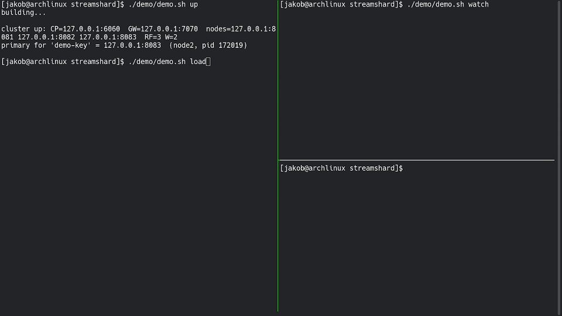

### Demo: overload protection

`demo/resilience.sh` runs all three overload/failure mechanisms
against a local cluster in one pass and prints what each one rejected:

```bash
$ ./demo/resilience.sh
building...

=== 1. token bucket (gateway): 30 fast writes to one key, bucket rate=5/s burst=3 ===
rate limited: 26/30 rejected with 429

=== 2. load shedding (node): 200 parallel writes at node0, queue-cap=1 ===
9/200 writes rejected with 429 because the queue was full.

=== 3. circuit breaker (gateway): kill node2, write until the breaker opens ===
Circuit Breaker detected the dead node and tripped to OPEN.
Gateway /health endpoint reports:
{"addr":"127.0.0.1:8093","depth":null,"overloaded":null,"breaker":"open","err":"Get \"http://127.0.0.1:8093/health\": dial tcp 127.0.0.1:8093: connect: connection refused"}

tearing down.
```

---

## Deploying on GCP

### Prerequisites

- [Terraform](https://www.terraform.io/) >= 1.5
- `gcloud` CLI authenticated (`gcloud auth application-default login`)
- GCP project `se-streamshard` with Compute Engine API enabled

Gateways scale 1:1 with nodes (`gateway_count` should match `node_count`) so a single
gateway never becomes the bottleneck. Replication routes over the static `--peers` ring,
and nodes default to `--no-idempotent` so committed writes are real durable appends. The
three required configs:

```bash
cd deploy/terraform
terraform init

# 1-node
terraform apply -var="node_count=1" -var="gateway_count=1" -var="rf=1"

# 3-node
terraform apply -var="node_count=3" -var="gateway_count=3"

# 5-node
terraform apply -var="node_count=5" -var="gateway_count=5"
```

Scaling out/in is a `terraform apply` with a different `node_count`; when shrinking, first move the leaving node's partition to a survivor via [Resharding](#resharding). Scaling up/down swaps `machine_type` and re-applies.

This brings up the SUT (nodes, gateways, control plane, and an external load balancer). The load balancer is a GCP TCP forwarding rule with a manually configured target pool and HTTP health check (`/health`); no managed load-balancing service is used.
The load-generation **GKE cluster is separate** and created once, see
[Benchmarking](#benchmarking) for the `gcloud container clusters create` command.

SWIM gossip membership is implemented but off by default (including in the benchmarks): `enable_swim=true` to turn it on.

### Bonus: larger instance type (vertical scaling)

```bash
terraform apply -var="node_count=3" -var="gateway_count=3" \
  -var="machine_type=e2-standard-4" -var="gateway_machine_type=e2-standard-4"
```

### Primary-driven replication (RF=3, alternative replication path)

By default the gateway fans out replica writes. With `--primary-replication` the
primary node fans out instead. Enable via:

```bash
terraform apply -var="node_count=3" -var="gateway_count=3" -var="rf=3" \
  -var="primary_replication=true"
```

Under measurement this path is **~2x slower** than gateway fan-out,
because each key's fan-out is concentrated on that key's single primary node, which
saturates its CPU. It does, however, scale close to linearly with vCPU (~1.8-2.0x
throughput for 2x cores), since the fan-out itself is parallel work. See *Scaling
behaviour*.

### Benchmark flags

`disable_ratelimit=true` (default) skips per-key rate limiting for clean throughput
measurement. Set to `false` for the rate-limiting demo.

Terraform outputs the gateway external IP. VMs build the binary from source on first boot. Check service status:

```bash
gcloud compute ssh streamshard-node-0 --zone=europe-west3-a --command "sudo systemctl status streamshard-node"
```

If a zone is capacity-constrained (`does not have enough resources`), override the
zone: `-var="zone=europe-west3-b"`. The GKE load-generation cluster is unaffected,
it reaches the gateway over the external load-balancer IP regardless of VM zone.

### Teardown

```bash
terraform destroy -auto-approve
```

`terraform destroy` deletes resources in dependency order automatically, so this is
normally all you need. If a previous destroy was interrupted (leaving the state
inconsistent), GCP can refuse to delete the target pool while the forwarding rule still
references it. In that case remove the rule first, then destroy the rest:

```bash
terraform destroy -auto-approve -target=google_compute_forwarding_rule.gateway_lb
terraform destroy -auto-approve
```

---

## Benchmarking

### Distributed load via GKE

One k6 process maxes out its own NIC before it can saturate StreamShard, so we spread the load. `run_benchmark.sh --k8s` runs N k6 pods on a GKE cluster, each doing a slice of the sweep, and `bench/k8s/aggregate.py` merges their results per offered-load step into the JSON `usl.py` reads.

Create the GKE load-generation cluster once. Use `pd-standard` disks:

```bash
gcloud container clusters create streamshard-bench \
  --project se-streamshard --zone europe-west3-a \
  --num-nodes 12 --machine-type e2-standard-2 \
  --disk-type pd-standard --disk-size 50 \
  --no-enable-autoupgrade --quiet
```

`--rps` is the **peak offered load at the top of the ramp** (total system, not per-node). The sweep staircases 0 until `--rps` over 40 steps and records achieved throughput per step. The operator splits `--rps` across `--workers` pods via execution segments.

#### Settings the result set was produced with

| Setting | Value | Why |
|---|---|---|
| `enable_swim` (terraform) | `false` | Replication uses the static `--peers` ring, so SWIM is not needed. |
| `--no-idempotent` (node) | on | Disables dedup so every write is a durable append. |
| `--workers` | `12` | 4 workers under-drove the high-ceiling configs (RF=1, gateway fan-out) and reported peaks below saturation. 12 pushes them over. |
| `--rps` (cap) | per config | Each config saturates at a different load, so an appropriate cap was chosen per config. |
| `--label-suffix` | none / `_pr` | No suffix = gateway fan-out (the default path); `_pr` = primary-replication runs (`primary_replication=true`). |
| `disable_ratelimit` (terraform) | `true` | Clean throughput, no per-key limiting. |
| `queue_cap` (terraform) | `8192` (default, unchanged) | Apply-queue capacity before 429 shedding; large enough that shedding rarely fires during the sweeps, so most rejections are 503 (quorum not reached under load), not 429. |

Example: the RF=1 sweep (gateway fan-out, 12 workers, per-config caps):

```bash
# Prerequisites: gcloud authed, kubectl installed, terraform applied, GKE cluster up
GW_IP=$(cd deploy/terraform && terraform output -raw lb_ip)

./bench/run_benchmark.sh "http://$GW_IP:7070" 1 --rps 80000 --k8s --workers 12 --rf rf1
./bench/run_benchmark.sh "http://$GW_IP:7070" 3 --rps 80000 --k8s --workers 12 --rf rf1
./bench/run_benchmark.sh "http://$GW_IP:7070" 5 --rps 80000 --k8s --workers 12 --rf rf1
```

Gateway fan-out is the default and gets no suffix. For primary-replication runs, deploy
with `-var="primary_replication=true"` and add `--label-suffix _pr`.

Results land in `bench/results/` as `{N}node_{instance}_{rf}{suffix}.json`. Once all three
node counts for a label are collected, fit/plot the curve (`--xmax` clips the load-generation tail for readability; it does not affect the peaks):

```bash
python3 bench/analysis/usl.py \
  bench/results/1node_e2_rf3.json \
  bench/results/3node_e2_rf3.json \
  bench/results/5node_e2_rf3.json \
  --nodes 1 3 5 \
  --title "RF=3 gateway-fanout, e2-standard-2" \
  --xmax 30000 \
  --out bench/results/scaling_rf3_gwfanout.png
```

### Reproducing the result set

`bench/run_matrix.sh` runs the whole sweep: for each cell it deploys the SUT
with Terraform, waits for health,
runs the load sweep through the GKE cluster, then tears the SUT down and moves to the next cell. 
The `MATRIX` covers RF=1 and RF=3 (gateway fan-out) on e2-standard-2, the RF=3 primary-replication 
path, and RF=3 on e2-standard-4 for both gateway-fanout and primary-replication. Each cell carries
its own worker count, per-config `--rps` cap, and suffix (none for gateway fan-out, `_pr`
for primary-replication). It skips any cell whose result JSON already exists.

The GKE load-generation cluster (above) must already exist; the matrix drives load
through it but does not create it.

```bash
./bench/run_matrix.sh
```

Results for each cell land in `bench/results/{N}node_{instance}_{rf}{suffix}.json`.

To run a single config by hand instead (cluster must already be deployed):

```bash
GW_IP=$(cd deploy/terraform && terraform output -raw lb_ip)
./bench/run_benchmark.sh "http://$GW_IP:7070" 5 --k8s --workers 12 --rps 40000 --rf rf3
```

### Local quick check

For a fast sanity run against a local or single deployed gateway, k6 can run the
sweep directly:

```bash
k6 run -e BASE_URL=http://localhost:7070 -e MAX_RPS=5000 bench/k6/write_sweep.js
```

### Additional data collected: CPU traces

`bench/poll_cpu.sh` samples per-process CPU on every node and gateway during a run.
`run_benchmark.sh` starts it automatically and writes one CSV per result
(`{N}node_..._cpu.csv`), so each throughput curve has a matching CPU trace. These traces
are what the CPU percentages in *Scaling behaviour* and *Findings* below are drawn from.

To run it standalone against an already-deployed cluster:

```bash
NODES=5 GATEWAYS=5 ./bench/poll_cpu.sh > /dev/null 2>&1 &   # start before a sweep
#  run a sweep
pkill -f poll_cpu.sh                       # stop when done
```

---

## Scaling behaviour

Committed write throughput under the 4 s SLA (see [Summary](#summary) for the metric and
methodology). Peak committed writes/s, e2-standard-2:

| Config | 1 node | 3 node | 5 node |
|--------|-------:|-------:|-------:|
| RF=1                       | 9,310 | 29,241 | 44,197 |
| RF=3 (gateway fan-out)     | 9,310 | 11,493 | 18,916 |
| RF=3 (primary-replication) | 9,310 |  5,587 |  8,571 |

RF=3 configs with primary replication enabled on e2-standard-4:

| Config | 1 node | 3 node | 5 node |
|--------|-------:|-------:|-------:|
| RF=3 (primary-replication) | 9,620 | 10,230 | 17,153 |

(1 node forces RF=1, so the 1-node column is identical across
RF=3 modes. The e2-standard-2 primary-replication 3/5-node
runs used 4 k6 workers, not 12; that is fine because the data-node CPU was already the
limiting resource, so 4 workers was enough to reach the real ceiling, see below.)

**RF=1 scales near-linearly with real writes** (9.3k -> 29k -> 44k). No replication, so a
write is one local append; throughput grows with the number of independent
gateway+nodes. 3-node measures ~105% of ideal-linear, within measurement noise: not
evidence of superlinear speedup.

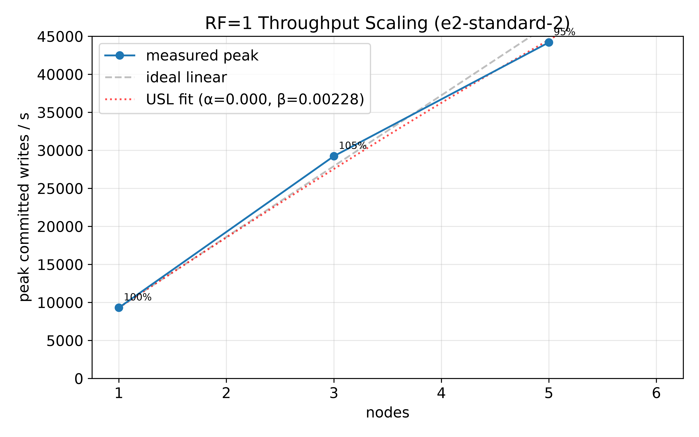
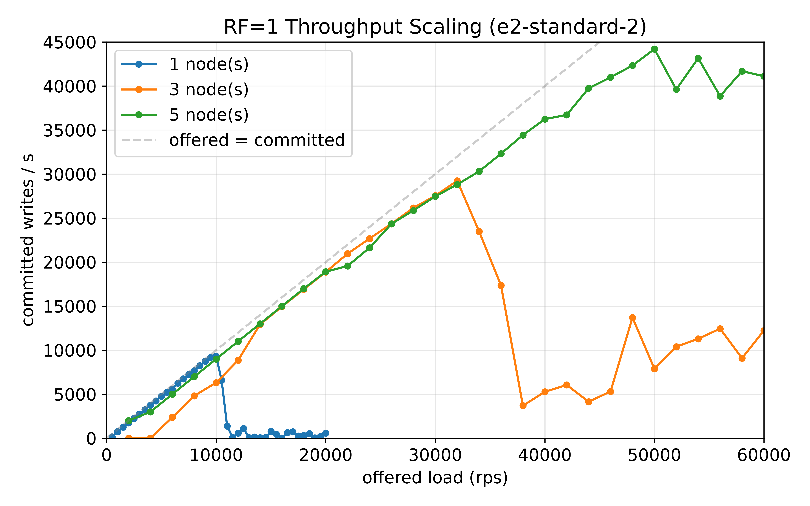

**Gateway fan-out beats primary-replication for throughput (~2×).** With gateway fan-out the replication work is
spread across all N gateways, so it scales (3-node 11.5k -> 5-node 18.9k). With
primary-replication the fan-out for a key is concentrated on that key's single primary
node, which pushes its CPU up, so 3-node PR (5.6k) drops *below* the 1-node
baseline (9.3k), and 5-node only recovers to 8.6k. CPU sampling confirms it: at the
the busiest node reaches 46-57% of the 2-vCPU ceiling under primary-replication
and 26-53% under gateway fan-out at the moment throughput peaks; CPU keeps climbing
well past that point as offered load increases further, without a matching rise in
committed throughput.

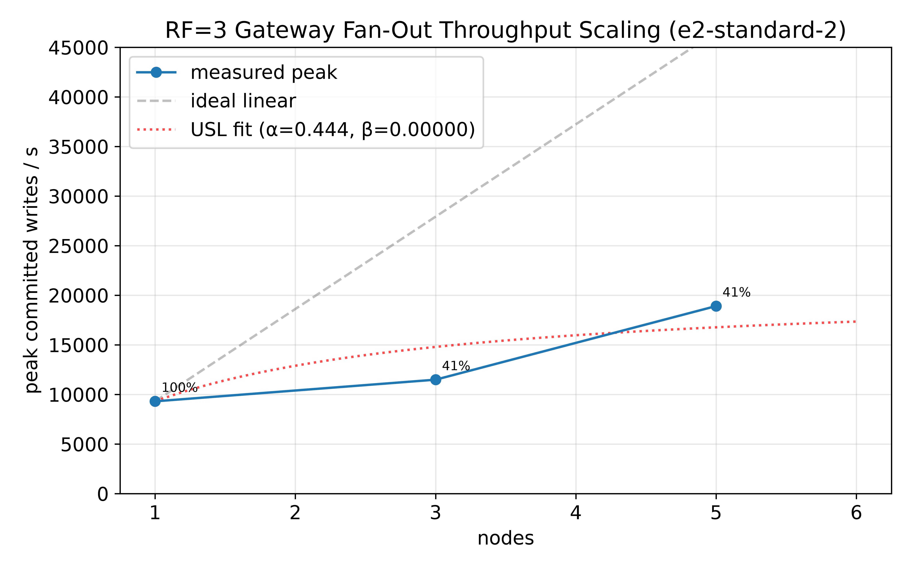
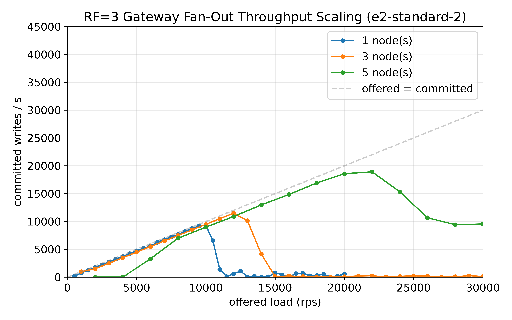

**Vertical scaling (e2-standard-4) doubles the primary-replication ceiling**, which
proves that path was CPU-bound on the primary. The two plots below are the same
primary-replication configuration on the two machine sizes:

| RF=3 primary-replication | 1 node | 3 node | 5 node |
|--------------------------|-------:|-------:|-------:|
| e2-standard-2 (2 vCPU)   | 9,310  |  5,587 |  8,571 |
| e2-standard-4 (4 vCPU)   | 9,620  | 10,230 | 17,153 |

Doubling the vCPU roughly doubled the replicated configs: 3-node went 5.6k -> 10.2k and
5-node went 8.6k -> 17.2k (both about 1.8-2.0x for 2x the cores). Throughput increasing with the core count shows that the limit was CPU, specifically the primary node doing
the replication fan-out. That fan-out is parallel work (a worker per replica), which is why vertical scaling helped here.

The 1-node number is the exception: it barely moves (9.3k -> 9.6k). With one node there
is no replication, so the node is not the busy part, the CPU samples show it mostly idle
while the gateway is maxed out. The 1-node work is serial, and adding more cores of the same speed cannot speed up serial work.

e2-standard-2 (baseline):

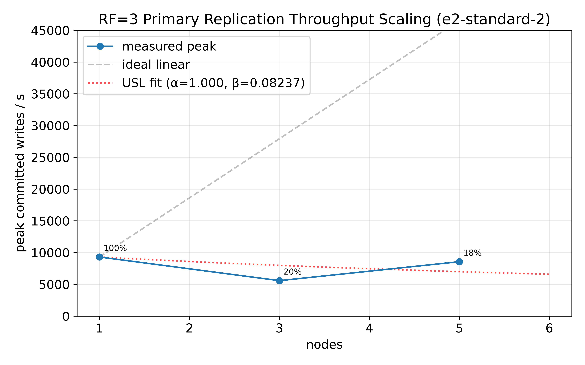
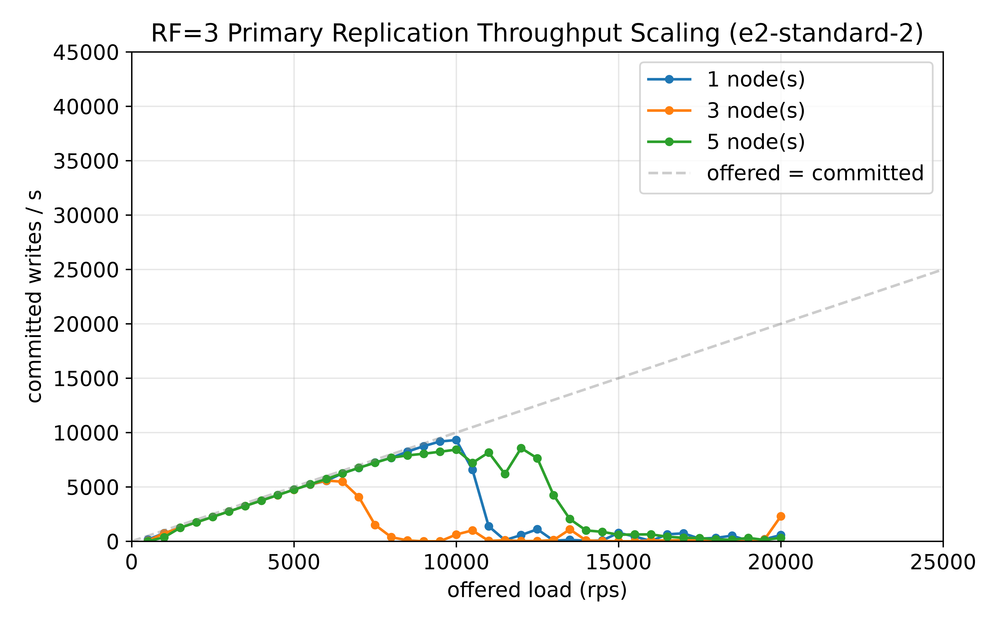

e2-standard-4 (2× vCPU):

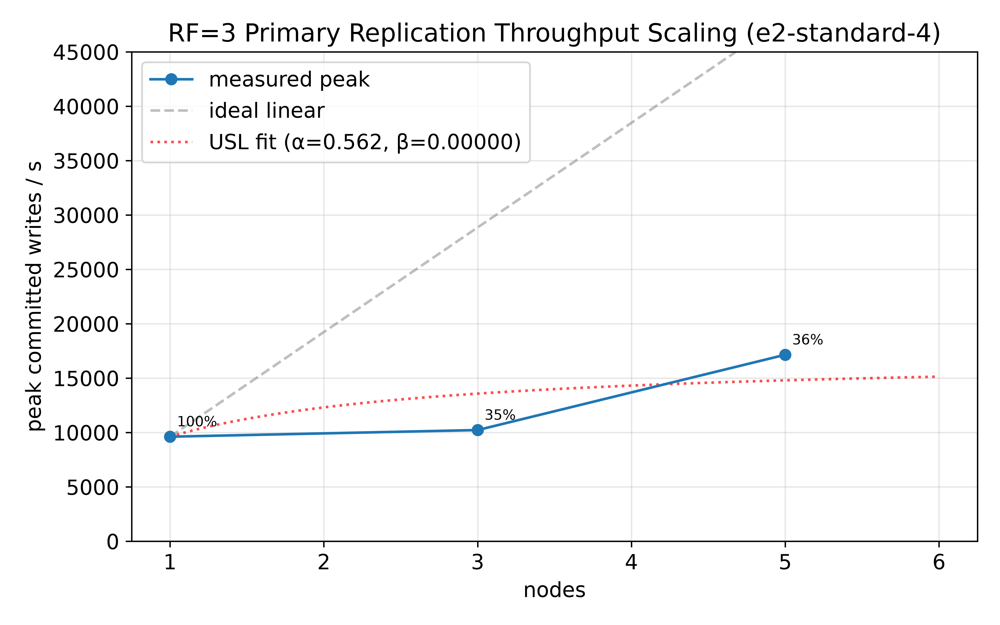
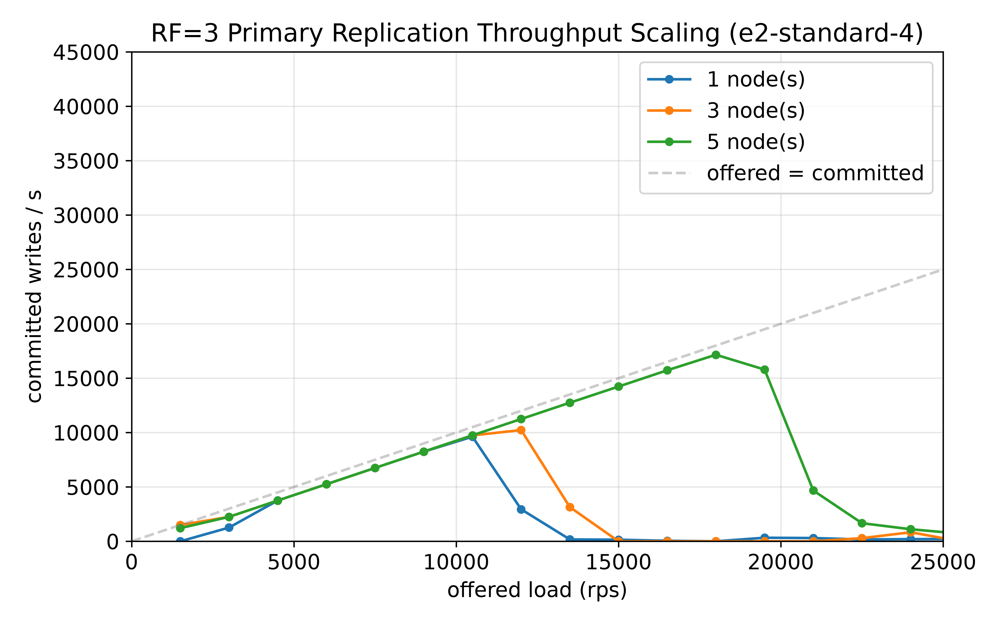

### CPU Speed vs. Core Count

To confirm the 1-node limit is serial, we ran the
same 1-node config on three machines. Doubling core count at the same clock speed had
almost no effect; a faster CPU clock was the variable that mattered.

| 1-node, RF=3 | cores / clock | peak committed/s |
|--------------|---------------|-----------------:|
| e2-standard-2 | 2 vCPU, ~2.5 GHz       | 9,310 |
| e2-standard-4 | 4 vCPU, ~2.5 GHz       | 9,620 |
| c2-standard-4 | 4 vCPU, **3.8 GHz**    | **11,180** |

The c2-standard-4 has the same core count as the e2-standard-4 but a 52% higher clock
speed, and delivers ~20% higher throughput, consistent with the apply loop being
single-threaded and clock-bound.

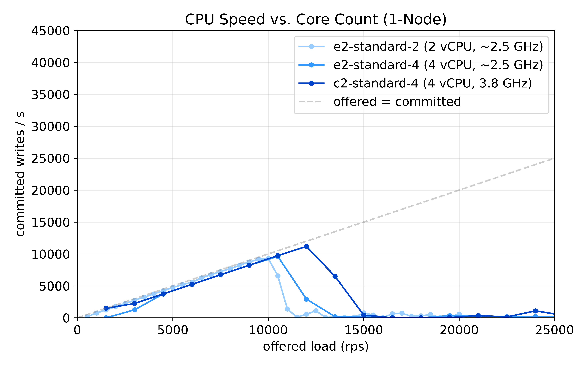

---

## Findings and next steps

Scaling out sidesteps the single-node ceiling because more nodes means more independent
single-threaded apply loops with no cross-node communication or replication sync between
them. The same win is available inside one node: add more partitions, sharding keys
across several apply workers instead of one, each with its own WAL.

WAL batching: a measured negative result: We added an opt-in `--wal-batch N` (drain
N queued writes, one `write()` syscall for the batch. It made 1-node throughput
worse, monotonically with batch size:

| `--wal-batch` | peak committed/s |
|--------------:|-----------------:|
| 1 (off)       | 9,620 |
| 8             | 8,206 |
| 64            | 6,734 |

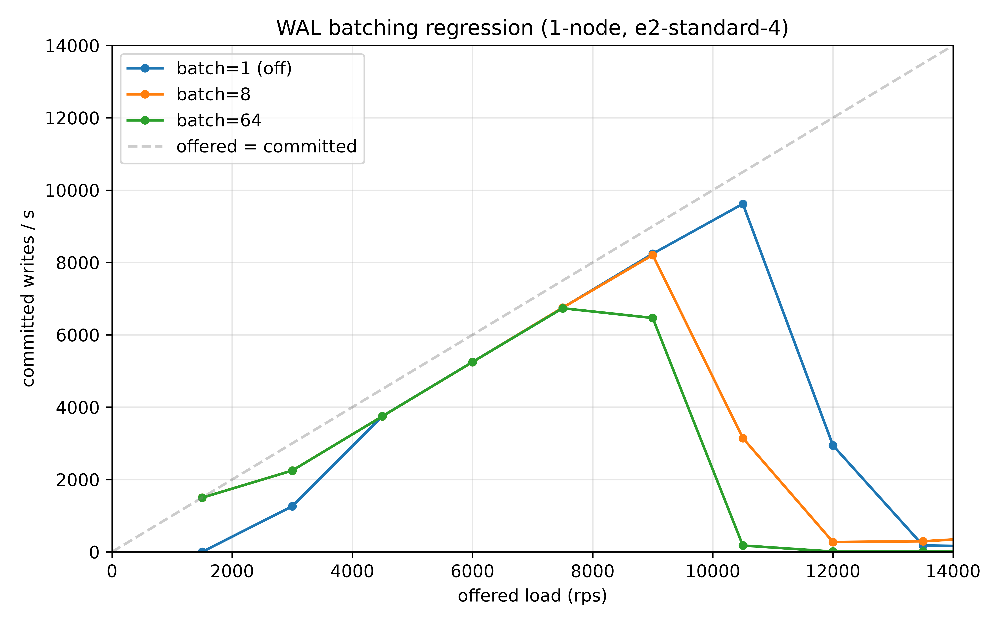

Acks are synchronous per request, but a batch can't reply to anyone until it fully
flushes. The apply worker holds the lock through the whole batch, so all N requests
wait on the slowest one and latency climbs. CPU traces confirm it is not resource
exhaustion: the node is ~45% idle at collapse, stalled on the lock. The limit is the
serial apply worker, so the ways up are sharding the partition into several apply
workers (intra-node parallelism) or a faster core (the c2 result above), not batching.

---

## API reference

### Node (`cmd/node`)

| Method | Path | Description |
|--------|------|-------------|
| POST | `/events` | Ingest event `{id, key, value}`. 201 fresh, 200 dup, 202 buffered (reshard), 409 stale epoch, 429 overloaded, 503 frozen |
| POST | `/replicate` | Replica write (same body, no re-routing) |
| GET | `/aggregates` | Windowed counts + top-K for this node's partition |
| GET | `/log?from=N` | Log entries from offset N |
| GET | `/snapshot` | Current compaction snapshot |
| GET | `/health` | Queue depth, epoch, reshard state |
| POST | `/reshard/freeze` | Freeze partition for snapshot transfer |
| POST | `/reshard/thaw` | Resume writes after reshard |
| POST | `/reshard/load` | Pull log from source and replay |
| POST | `/reshard/abort` | Abort a stuck live reshard, clear Loading state |

### Gateway (`cmd/gateway`)

| Method | Path | Description |
|--------|------|-------------|
| POST | `/events` | Route to owner via ring. Default: gateway fans out to replicas, returns after W acks, remaining replicas propagate in the background (detached context) to reach RF. With `--primary-replication`: gateway sends only to the primary, which fans out itself |
| GET | `/aggregates` | Scatter-gather from all nodes, merge counts |
| GET | `/ring?key=K` | Show owner + replicas for key K |
| GET | `/health` | Per-node queue depth + circuit-breaker state |
| GET | `/swim` | Current SWIM member list |

### Control plane (`cmd/controlplane`)

| Method | Path | Description |
|--------|------|-------------|
| GET | `/epoch?partition=P` | Current epoch for partition |
| POST | `/epoch/bump?partition=P` | Increment and return epoch |
| GET | `/epochs` | All partition epochs |
| POST | `/reshard` | Orchestrate reshard (`live` bool, default true) |
| POST | `/failover` | Bump epoch for a dead node, fence it out |

---

## Limitations

**Consensus / epoch**
- No Raft or Paxos; the single control plane is a disclosed SPOF for epoch assignment and resharding. Production would use etcd or ZooKeeper
- Only one epoch namespace (`_default`), so there is no true per-shard fencing if you add multiple logical partitions
- Gateway epoch is in-memory; if the gateway and CP restart at the same time there is a brief window where the epoch could be stale
- No two-phase quorum promotion; a replica is promoted by bumping the epoch via CP, not by a Paxos round

**Ring / routing**
- Overload detection lags by up to 1s because the gateway polls node health on an interval
- The SWIM member list is in-memory and repopulates from seeds within about 1s on restart
- Without incarnation numbers, a falsely suspected node gets removed from the ring and has to rejoin
- With multiple gateways, ring updates can lag by under a second via SWIM. During that window a write might go to the old or new node. Epoch fencing triggers a retry for the synchronous reshard path, but the live reshard path has no epoch bump so brief replica divergence is possible
- The /reshard endpoint transfers an entire WAL from source to target without filtering by specific consistent-hash ranges. Target nodes acquire the historical data they need, but waste disk space storing historical keys they do not own.
- The ring has no notion of zone/region; `Replicas(key, rf)` picks purely by hash proximity, and the Terraform deployment puts every node in one zone. RF=3 tolerates node failure but not a zone-level outage, since all replicas of a key can share the same failure domain

**Replication**
- Replicas are propagated asynchronously and can lag behind the primary
- W=2 acks the write before the 3rd replica confirms; if that replica never catches up there is no anti-entropy or hinted handoff to repair it
- `GET /aggregates` scatter-gathers every node's local, non-replicated view and merges it. A node mid-lag on replicated writes is queried, so the merged result can be momentarily stale with no read quorum to catch it
- Resharding is manual; node death does not automatically trigger a rebalance or replica promotion
- Reshard moves one partition source -> target; it does not detect or heal under-replication after a node death

**Log / storage**
- One apply worker per node serializes commits at ~10k writes/s; the fix is sharding the partition by key across workers (see [Findings](#findings-and-next-steps))
- WAL is fsynced every 100ms, so up to 100ms of writes can be lost on a hard crash
- No ordering guarantee across replicas; concurrent writes may be applied in different orders
- Idempotency index is unbounded in memory and never cleared

**Aggregates**
- One partition per node with no further key-space splitting inside it
- Window eviction runs on writes and queries, not on a background timer
- Top-K uses exact counts, which does not scale to high cardinality (a Count-Min Sketch would)

**Load shedding**
- Shedding is per-node, not per-key, so a hot key can starve other keys on the same node
- The gateway learns about overload reactively via 429s or health polls, with no proactive signal from the node

**Token bucket**
- Buckets are per-key but per-gateway, so two gateways effectively double the allowed rate
- No coordination across gateways
- Idle keys are swept every minute, but the map is unbounded in concurrently-active keys; high key cardinality with no idle keys means a bucket per key held permanently in memory

**Security**
- All traffic is plaintext HTTP, no TLS
- No authentication; any client can write, read, or trigger a reshard

### Future work

- **Two-phase routing transition:** coordinate ring updates across gateways before committing, closing the multi-gateway consistency window during resharding
- **Freshness check on aggregate reads:** each node currently answers `/aggregates` from whatever it has locally, even if it is lagging on replicated writes; a lag/version signal per node would let the merge flag or exclude stale contributions
- **Anti-entropy / hinted handoff:** background repair for replicas missed by the W-ack path
- **Per-shard epoch fencing:** one epoch per logical partition instead of a single `_default` namespace
- **Incarnation numbers:** per-node counter in SWIM so a falsely-suspected node can refute dead events before they propagate
- **Per-key queue isolation:** intra-node fairness between keys; matters at high cardinality or skewed workloads
- **Hot-key mitigation:** a single hot key is capped at one primary's throughput no matter how many nodes are in the cluster. Fix: temporarily add a second writer for that key with CRDT-merged aggregates, collapsing back to one once it cools down. The count merges cleanly (a G-counter: sum on merge, order-independent) and gets strong eventual consistency for free; windowed eviction does not, since it depends on wall-clock time at merge, not just which updates were received, so it would need its own timestamp-aware merge design
- **Count-Min Sketch for top-K:** bound memory at high cardinality
- **Global rate limiting:** coordinate token bucket state across gateways
